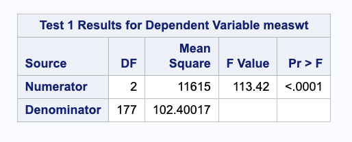

# This is Jeff's awesome website

elmo gif 

adding text
  * and lists
  
You can *format* and **bold** just like normal R markdown 

# new section 

adding an image 

You have to name your file "index.Rmd" (lowercase) and the "_site.yml" file can be used for site-wide settings. A setting in _site.yml does not need to be in the index.Rmd file. 

link to another page on the website [about](about.html). 

<i class="fa-solid fa-hippo fa-2xl"></i>
